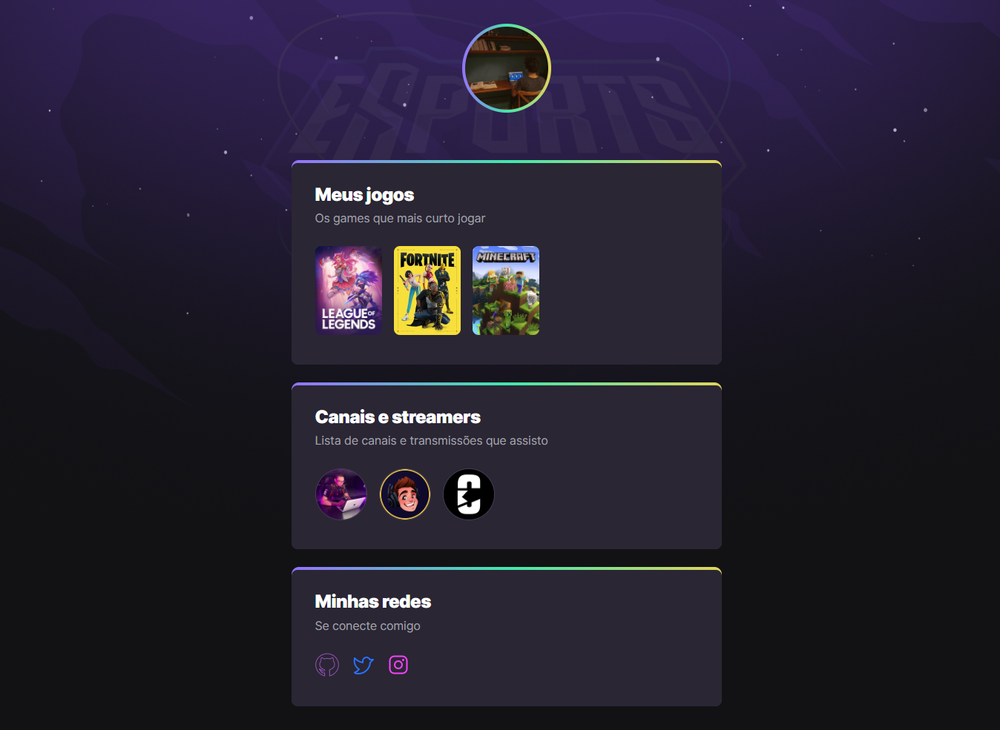

# NLW eSports

> ☄️ Trilha Explorer ☄️

Projeto construído no evento Next Level Week da Rocketseat. O Game hub, um site centralizador de links, no estilo Linktree, feito especialmente para gamers.
Na aula cinco fiz a animação e transição no CSS do projeto.

🔗 [Clique aqui para acessar no github](https://github.com/MarcylleneMaria/NLW-Rockeseat-2022-Stage-4)

🔗 [Clique aqui para acessar o site](https://nlw-esports-marcyllene.netlify.app/)

## 🌌 Tecnologias 

- HTML
- CSS
- Git e Github

## Detalhes das aulas
Inicialmente na aula um (Base Building) foi preparado o nosso ambiente do VSCode para construir as bases e dar início ao projeto. Na aula dois (High speed) avançei no desenvolvimento do projeto colocando a mão no código e dando passos em HTML. Na aula três (To be continued) foi dada continuidade na construção do site com CSS. Na aula quatro (Power up) fiz a animação e transição do projeto no CSS, também aprendi a manusear melhor o GitHub e escrever e personalizar o readme.

## 📍 Contato

📧 marcyllenemaria@id.uff.br
